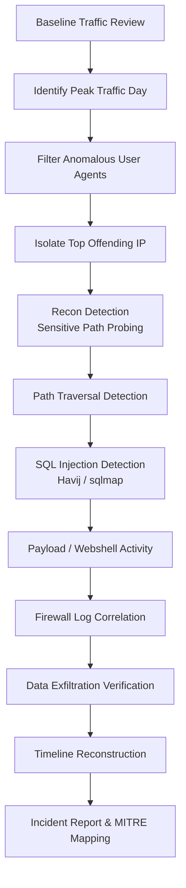
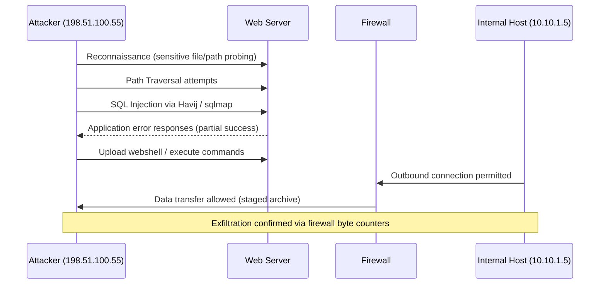

# 🛡️ SOC Threat Detection & Incident Response using Splunk SIEM


> An end-to-end SOC investigation of a simulated web application compromise, performed independently using Splunk Enterprise SIEM. This repository documents the full analyst workflow — from anomaly detection through timeline reconstruction and incident reporting — in the format used by real Security Operations Centers.

---

## 📌 Project Overview

This project simulates the role of a **Tier 1/2 SOC Analyst** responding to suspicious activity on a public-facing web application. Working directly in **Splunk Enterprise**, I ingested web server and firewall telemetry, built SPL queries from scratch, and manually walked through the analyst decision-making process that turns raw logs into an actionable incident report.

The investigation was self-directed: rather than following a prescribed answer sheet, each pivot (traffic spike → anomalous user agents → suspicious paths → SQLi → exfiltration) was derived from what the previous query surfaced, mirroring how a real triage-to-containment workflow unfolds.

**Environment used for practice:** a hosted Splunk lab environment with pre-loaded web and firewall telemetry (TryHackMe). All findings, queries, write-ups, and analysis in this repository are my own original work and do not reproduce any third-party walkthrough content.

---

## 🎯 Objectives

- Detect anomalous traffic patterns in web server logs using statistical baselining
- Identify and fingerprint automated attack tooling via user-agent analysis
- Investigate and confirm SQL Injection and Path Traversal exploitation attempts
- Correlate web logs with firewall logs to trace attacker infrastructure
- Identify indicators of Command & Control (C2) and staged data exfiltration
- Reconstruct a full attack timeline from initial recon to data theft
- Produce a professional incident report with actionable recommendations
- Map all observed adversary behavior to the MITRE ATT&CK framework

---

## 🔍 Investigation Workflow



## ⚔️ Attack Flow (Adversary Perspective)



---

## 🗂️ Repository Structure

```
soc-threat-detection-splunk-siem/
│
├── README.md                          # Project overview (this file)
├── LICENSE                            # MIT License
├── .gitignore
│
├── images/                            # Evidence screenshots (Splunk UI)
│
├── docs/
│   ├── incident_report.md             # Formal SOC incident report
│   ├── investigation_notes.md         # Step-by-step analyst notes
│   ├── ioc.md                         # Indicators of Compromise
│   ├── mitre_attack_mapping.md        # MITRE ATT&CK technique mapping
│   └── timeline.md                    # Chronological attack timeline
│
└── spl_queries/                       # One document per SPL query used
    ├── 01_baseline_traffic_overview.md
    ├── 02_daily_traffic_distribution.md
    ├── 03_peak_day_identification.md
    ├── 04_anomalous_user_agent_filter.md
    ├── 05_top_offending_ip_identification.md
    ├── 06_sensitive_path_recon_detection.md
    ├── 07_path_traversal_pattern_detection.md
    ├── 08_path_traversal_frequency_analysis.md
    ├── 09_sql_injection_tool_detection.md
    ├── 10_staged_archive_access_detection.md
    ├── 11_webshell_command_execution_detection.md
    ├── 12_firewall_correlation_allowed_traffic.md
    └── 13_data_exfiltration_volume_analysis.md
```

---

## 🖼️ Screenshots

Evidence captured directly from the Splunk Search & Reporting interface during the investigation (stored in `/images`):

| Screenshot | Description |
|---|---|
| `01_baseline_search.png` | Initial baseline search across the web traffic index |
| `02_top_offending_ip.png` | Statistical isolation of the top anomalous client IP |
| `03_daily_traffic_distribution.png` | Daily event distribution used to identify the peak-activity day |
| `04_user_agent_breakdown.png` | Top user-agent values revealing automated tooling (Havij, sqlmap) |
| `05_path_breakdown.png` | Top requested paths revealing traversal and injection attempts |
| `06_firewall_exfil_correlation.png` | Firewall log correlation confirming outbound data transfer volume |

---

## 📊 Key Findings

| Finding | Detail |
|---|---|
| **Attacker IP** | `198.51.100.55` |
| **Peak Activity Day** | 2025-10-12 |
| **SQL Injection Events (Havij)** | 993 events |
| **Path Traversal Attempts** | 658 attempts |
| **Data Transferred to Attacker Infrastructure** | 126,167 bytes |
| **Primary Attack Vectors** | SQL Injection, Path Traversal, Sensitive File Recon, Webshell Execution |
| **Exfiltration Confirmed** | Yes — via firewall byte-count correlation |

Full breakdown available in [`docs/incident_report.md`](docs/incident_report.md).

---

## 🛠️ Tools & Technologies Used

- **Splunk Enterprise** — SIEM platform for log ingestion, search, and correlation
- **Splunk Search Processing Language (SPL)** — custom query authoring for detection logic
- **Apache-style Web Access Logs** — primary evidence source
- **Firewall Logs** — network-layer correlation and exfiltration verification
- **MITRE ATT&CK Framework** — adversary behavior mapping

---

## 🧠 Skills Demonstrated

- SIEM log analysis and threat hunting
- Writing and optimizing SPL queries for detection use cases
- Statistical/behavioral anomaly detection (traffic baselining, user-agent fingerprinting)
- Web application attack detection (SQLi, Path Traversal, LFI-style probing)
- Cross-source log correlation (web ↔ firewall)
- Data exfiltration analysis
- Timeline reconstruction and evidence chaining
- MITRE ATT&CK technique mapping
- Professional SOC incident report writing

---

## 🎯 MITRE ATT&CK Summary

| Tactic | Technique | ID |
|---|---|---|
| Reconnaissance | Active Scanning | T1595 |
| Initial Access | Exploit Public-Facing Application | T1190 |
| Execution | Command and Scripting Interpreter | T1059 |
| Persistence | Server Software Component: Web Shell | T1505.003 |
| Collection | Data Staged | T1074 |
| Exfiltration | Exfiltration Over C2 Channel | T1041 |

Full mapping with justification available in [`docs/mitre_attack_mapping.md`](docs/mitre_attack_mapping.md).

---

## 📘 Learning Outcomes

Through this project I strengthened my ability to:

- Think like both a defender and an attacker when reviewing raw logs
- Build SPL queries iteratively, starting broad and narrowing based on evidence
- Distinguish legitimate traffic noise from genuine indicators of compromise
- Correlate multiple log sources to validate a single hypothesis (exfiltration)
- Communicate technical findings in a format non-technical stakeholders can act on
- Structure a real-world SOC incident report end-to-end

---

## 📄 Related Documentation

- [Incident Report](docs/incident_report.md)
- [Investigation Notes](docs/investigation_notes.md)
- [Indicators of Compromise (IOC)](docs/ioc.md)
- [MITRE ATT&CK Mapping](docs/mitre_attack_mapping.md)
- [Attack Timeline](docs/timeline.md)
- [SPL Query Library](spl_queries/)

---

## 👤 Author

**Yuvraj Singh**
Certified Ethical Hacker (CEH v13)
[LinkedIn](https://linkedin.com/in/yuvraj-singh-997a45372)

---

## 📝 License

This project is licensed under the [MIT License](LICENSE).
