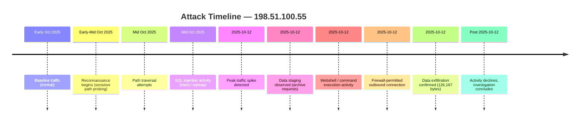

# Attack Timeline

A chronological reconstruction of the incident, based on log evidence gathered during the investigation. All timestamps reflect activity attributed to source IP `198.51.100.55` unless otherwise noted.

---

## Timeline of Events

| Phase | Date / Window | Event | Source |
|---|---|---|---|
| 1 | Early October 2025 | Baseline (pre-attack) traffic patterns observed; no anomalies present | `web_traffic` |
| 2 | Early–mid October 2025 | Gradual increase in requests from `198.51.100.55`; early reconnaissance begins (sensitive path probing: `.env`, `.git`, `phpinfo`) | `web_traffic` |
| 3 | Mid October 2025 | Path traversal attempts begin against application endpoints, including direct targeting of system files | `web_traffic` |
| 4 | Mid October 2025 | Automated SQL injection activity begins via Havij and sqlmap tooling against application query parameters | `web_traffic` |
| 5 | **2025-10-12** | **Peak activity day** — traffic volume from the attacker IP spikes well above baseline, triggering the investigation | `web_traffic` |
| 6 | 2025-10-12 | Requests referencing staged archive filenames (`backup.zip`, `logs.tar.gz`) observed, indicating data consolidation | `web_traffic` |
| 7 | 2025-10-12 | Requests consistent with webshell upload and command execution observed (`upload.php`, command-style parameters) | `web_traffic` |
| 8 | 2025-10-12 | Firewall logs show outbound connections from internal host `10.10.1.5` to `198.51.100.55` permitted by policy | `firewall_logs` |
| 9 | 2025-10-12 | Aggregate outbound transfer of **126,167 bytes** confirmed between internal host and attacker infrastructure | `firewall_logs` |
| 10 | Post 2025-10-12 | Traffic volume from the attacker IP declines; investigation shifts to evidence consolidation and reporting | `web_traffic` |

---

## Timeline Visualization

---

## Key Observation

Every phase of this attack — reconnaissance, exploitation, staging, and exfiltration — occurred within a compressed window culminating on a single peak day. This underscores the importance of low-latency detection: by the time volume anomalies are visible in daily reporting, an attacker following this pattern may already be in the exfiltration phase.
